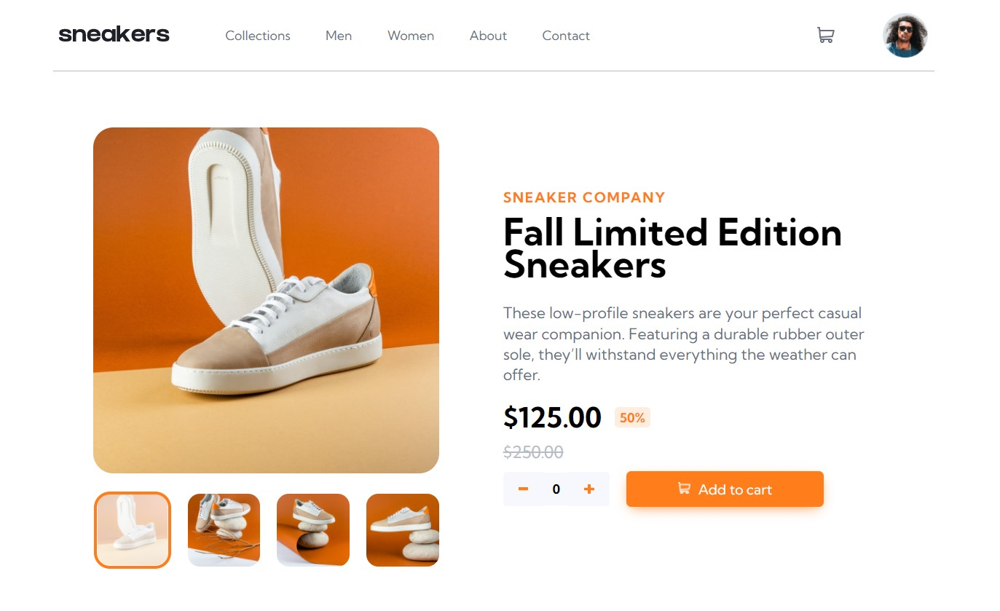

# Frontend Mentor - E-commerce product page solution

This is my solution to the [E-commerce product page challenge on Frontend Mentor](https://www.frontendmentor.io/challenges/ecommerce-product-page-UPsZ9MJp6).

## Table of contents

-   [Overview](#overview)
    -   [The challenge](#the-challenge)
    -   [Screenshot](#screenshot)
    -   [Links](#links)
-   [My process](#my-process)
    -   [Built with](#built-with)
    -   [What I learned](#what-i-learned)
    -   [Continued development](#continued-development)

## Overview

### The challenge

Users should be able to:

-   View the optimal layout for the site depending on their device's screen size
-   See hover states for all interactive elements on the page
-   Open a lightbox gallery by clicking on the large product image
-   Switch the large product image by clicking on the small thumbnail images
-   Add items to the cart
-   View the cart and remove items from it

### Screenshot

### Links

-   Solution URL: [https://github.com/andy-devs/ecommerce-product-page](https://github.com/andy-devs/ecommerce-product-page)
-   Live Site URL: [https://andy-devs.github.io/ecommerce-product-page/](https://andy-devs.github.io/ecommerce-product-page/)

## My process

### Built with

-   HTML
-   SCSS
-   JavaScript
-   [Lightbox](https://lokeshdhakar.com/projects/lightbox2/) - JavaScript library that displays images and videos

### What I learned

I learned how to build a sidebar on mobile devices, build a cart with function to add and remove items in it. Although, I struggled with lightbox gallery and haven't done it properly.

### Continued development

I think I'll do another project with JavaScript or start learning Algorithms and Data Structures.
